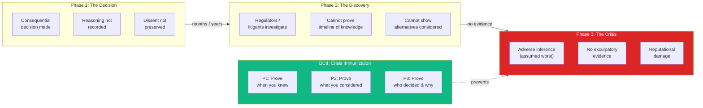
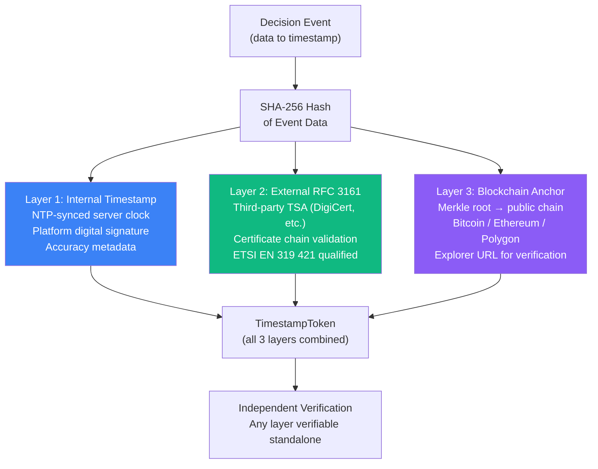
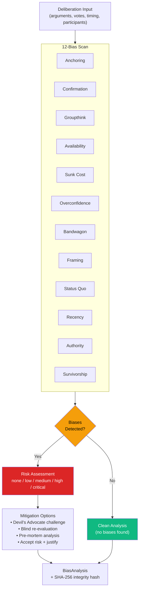
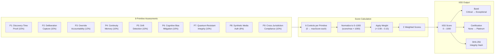
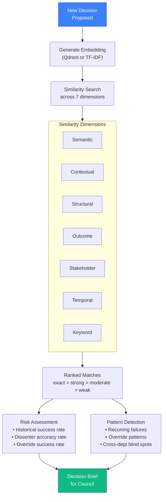
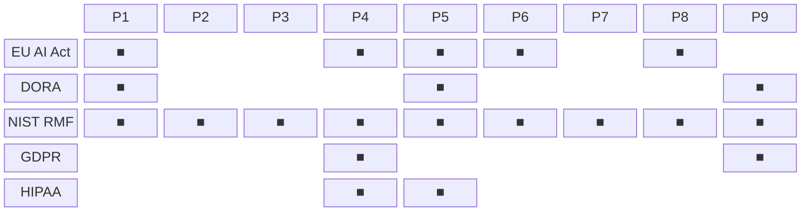
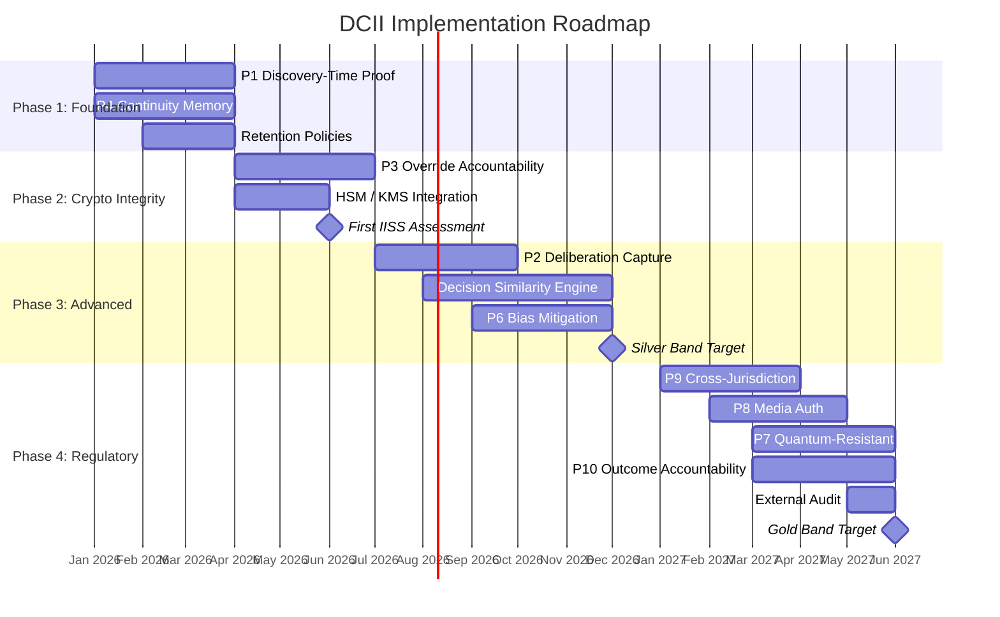

# Decision Crisis Immunization Infrastructure (DCII): A Framework for Auditable AI Governance

**Version 2.1 | February 19, 2026**

**Authors:**
Stuart Rainey, Founder & Chief Architect, Datacendia, LLC.

---

**Abstract:**
As artificial intelligence systems become embedded in high-stakes decision-making across regulated industries, organizations face an unprecedented challenge: proving that AI-assisted decisions were made correctly when challenged years later under adversarial scrutiny. This paper introduces the Decision Crisis Immunization Infrastructure (DCII), a comprehensive framework built on nine core primitives — plus one extended primitive (P10: Outcome Accountability) — that enable organizations to generate cryptographically verifiable evidence trails for AI-assisted decisions. We demonstrate how DCII addresses gaps in existing AI governance frameworks, provides a reference implementation for regulatory compliance (EU AI Act, NIST AI RMF, DORA), and introduces the Institutional Immune System Score (IISS™) as a quantitative measure of organizational resilience to decision-related crises. Version 2.1 provides verified implementation details from the production Datacendia platform, including database schemas, API surfaces, scoring methodology, and an honest assessment of current limitations.

**Keywords:** AI governance, explainable AI, audit trails, regulatory compliance, decision intelligence, cryptographic evidence, institutional resilience

---

## Table of Contents

1. [Introduction](#1-introduction)
2. [The DCII Framework: Nine Core Primitives](#2-the-dcii-framework-nine-core-primitives)
3. [Primitive Implementations](#3-primitive-implementations)
4. [Extended Primitive: P10 Outcome Accountability](#4-extended-primitive-p10-outcome-accountability)
5. [The Institutional Immune System Score (IISS™)](#5-the-institutional-immune-system-score-iiss)
6. [The Decision Similarity Engine](#6-the-decision-similarity-engine)
7. [Reference Implementation Architecture](#7-reference-implementation-architecture)
8. [Database Architecture](#8-database-architecture)
9. [API Reference](#9-api-reference)
10. [Compliance Mapping](#10-compliance-mapping)
11. [Insurance and Regulatory Impact](#11-insurance-and-regulatory-impact)
12. [Industry Benchmarks (Projected)](#12-industry-benchmarks-projected)
13. [Reference Architecture Case Studies (Projected)](#13-reference-architecture-case-studies-projected)
14. [Comparison to Existing Frameworks](#14-comparison-to-existing-frameworks)
15. [Limitations](#15-limitations)
16. [Open Research Questions](#16-open-research-questions)
17. [Implementation Roadmap](#17-implementation-roadmap)
18. [Conclusion](#18-conclusion)
19. [References](#19-references)
20. [Appendix A: Primitive Measurement Criteria](#appendix-a-primitive-measurement-criteria)
21. [Appendix B: Sample Regulator's Receipt](#appendix-b-sample-regulators-receipt)
22. [Appendix C: Service File Inventory](#appendix-c-service-file-inventory)
23. [Appendix D: Exported Type Summary](#appendix-d-exported-type-summary)

---

## 1. Introduction

### 1.1 The Decision Crisis Problem

Modern organizations face a paradox: AI systems can improve decision quality, but the opacity of these systems creates existential legal and regulatory risk. When a decision is challenged — whether in litigation, regulatory investigation, or public scrutiny — organizations must answer three questions:

1. **Process verification:** Was the decision made using an appropriate, documented process?
2. **Evidence integrity:** Can we prove the decision inputs, reasoning, and context have not been altered?
3. **Temporal authenticity:** Can we demonstrate what information was available at the time of decision, not reconstructed post-hoc?

Traditional AI governance frameworks focus on model explainability and fairness but fail to address the evidentiary requirements of adversarial scrutiny. DCII fills this gap.

Every major institutional failure in the last two decades follows a predictable pattern. First, an organization makes a consequential decision where the reasoning, alternatives considered, and dissenting views are either not recorded or recorded incompletely. Months or years later, regulators or litigants discover the decision was flawed, and the organization cannot demonstrate when they knew what they knew. Without defensible evidence, the organization faces regulatory penalties with adverse inference, litigation with no exculpatory evidence, and reputational damage.

**The root cause is not bad decisions — it is the inability to prove the decision process was sound.**



*Figure 5: The Decision Crisis lifecycle — DCII immunizes organizations by ensuring evidence exists before the crisis arrives.*

### 1.2 Regulatory Context

Three converging regulatory regimes create urgent demand for decision evidence infrastructure:

**EU AI Act (2024):** Article 13 requires "transparency and provision of information to deployers" with documentation that enables "understanding of the system and its outputs." High-risk AI systems must maintain logs "to the extent such logs are under their control" (Article 12).

**DORA (Digital Operational Resilience Act, 2025):** Requires financial entities to maintain "comprehensive ICT-related incident registers" and demonstrate "sound, comprehensive and well-documented arrangements" for operational resilience.

**NIST AI RMF (2023):** The "Govern" function requires "policies, processes, procedures, and practices are in place to manage AI risks" with "documentation and transparency" as core outcomes.

**Gap:** None of these frameworks specify *how* to generate court-admissible evidence for AI-assisted decisions. DCII provides the implementation layer.

### 1.3 Relationship to Decision Governance Infrastructure (DGI)

DCII is a **reference implementation** of Decision Governance Infrastructure (DGI), an open, vendor-neutral framework for institutional decision accountability published by Datacendia in 2026. While DGI defines five core governance primitives (A–E) applicable to any institutional decision environment, DCII extends this foundation with domain-specific primitives addressing AI governance, jurisdictional complexity, and outcome tracking.

**DGI → DCII Mapping:**
- DGI Primitive A (Context Capture) → DCII P1 (Discovery-Time Proof) + P4 (Continuity Memory)
- DGI Primitive B (Deliberation Traceability) → DCII P2 (Deliberation Capture)
- DGI Primitive C (Override Accountability) → DCII P3 (Override Accountability)
- DGI Primitive D (Evidence Integrity) → DCII P7 (Quantum-Resistant Integrity) + P8 (Synthetic Media Auth)
- DGI Primitive E (Drift Detection) → DCII P5 (Drift Detection)

DCII's extended primitives (P6 Bias Mitigation, P9 Cross-Jurisdiction, P10 Outcome Accountability) represent competitive differentiation beyond the baseline DGI standard.

### 1.4 Implementation Status

The DCII framework is fully operational in the Datacendia platform (CendiaDCII™ v3.0). All 9 core primitives are implemented through **7 production services** backed by **15 PostgreSQL tables**, exposed via **59 REST API endpoints**, and scored through the IISS — a standardized 0–1000 metric. An extended 10th primitive (Outcome Accountability) was added February 17, 2026.

---

## 2. The DCII Framework: Nine Core Primitives

DCII is built on nine core measurable primitives that collectively enable "crisis immunization" — the ability to survive adversarial scrutiny of past decisions.

| # | Primitive | The Question It Answers | Implementing Service |
|---|-----------|------------------------|---------------------|
| P1 | **Discovery-Time Proof** | "When did you know?" | CendiaTimestamp™ |
| P2 | **Deliberation Capture** | "What did you consider?" | CendiaCouncil + CendiaVault |
| P3 | **Override Accountability** | "Who decided — and why?" | CendiaResponsibility + CendiaNotary |
| P4 | **Continuity Memory** | "Is knowledge preserved?" | CendiaMemory + Pantheon |
| P5 | **Drift Detection** | "Are you still compliant?" | CendiaPanopticon |
| P6 | **Cognitive Bias Mitigation** | "Did you challenge assumptions?" | CendiaBiasMitigation™ |
| P7 | **Quantum-Resistant Integrity** | "Is the proof future-proof?" | PostQuantumKMS |
| P8 | **Synthetic Media Auth** | "Is the evidence authentic?" | CendiaMediaAuth™ |
| P9 | **Cross-Jurisdiction Compliance** | "Did you comply everywhere?" | CendiaJurisdiction™ |
| P10 | **Outcome Accountability** *(Extended)* | "What actually happened?" | CendiaRecall™ |

### Core Primitive Weighting (IISS Scoring)

Weights reflect relative contribution to crisis survival. P10 is an extended primitive not yet incorporated into the IISS score (planned for IISS v2.0):

| Primitive | Weight | Rationale |
|-----------|--------|-----------|
| P1 — Discovery-Time Proof | **15%** | Most litigated question in regulatory proceedings |
| P2 — Deliberation Capture | **15%** | Core defensibility — proves the process existed |
| P3 — Override Accountability | **12%** | High-profile failures involve overridden recommendations |
| P4 — Continuity Memory | **10%** | Critical during leadership transitions and M&A |
| P5 — Drift Detection | **10%** | Prevents slow erosion creating compliance gaps |
| P6 — Cognitive Bias Mitigation | **10%** | Demonstrates intellectual rigor and duty of care |
| P7 — Quantum-Resistant Integrity | **10%** | Future-proofing (10+ year evidentiary shelf life) |
| P8 — Synthetic Media Auth | **8%** | Emerging threat vector, growing regulatory importance |
| P9 — Cross-Jurisdiction Compliance | **10%** | Essential for any multinational organization |

Each primitive is assessed through **6 technical controls**, each scored against a defined maximum. The weighted, normalized sum produces the IISS score.

---

## 3. Primitive Implementations

### 3.1 P1: Discovery-Time Proof

**Definition:** Cryptographic proof of when information became known and decisions were made, preventing backdating and post-hoc rationalization.

#### Technical Controls

| Control | Max Score | Requirement |
|---------|-----------|-------------|
| Cryptographic Timestamping | 40 | RFC 3161 compliant timestamps on all decision events |
| Event Linkage | 30 | Timestamps linked to deliberation records |
| Tamper Evidence | 40 | Merkle tree integrity with independent verification |
| Non-Repudiation | 30 | Digital signatures with delivery proof |
| Blockchain Anchoring | 20 | Optional external anchoring for highest-stakes decisions |
| Evidence Packet Generation | 40 | One-click regulator-ready evidence export |

#### Implementation: CendiaTimestamp™

Three-layer defense-in-depth:

**Layer 1 — Internal:** Server clock with NTP sync, SHA-256/384/512/SHA3-256, digital signature, accuracy metadata.

**Layer 2 — External RFC 3161:** Multi-provider (DigiCert, Comodo, FreeTSA, GlobalSign, Entrust), full RFC 3161 token, TSA certificate chain validation. Standards: RFC 3161, RFC 3628, ETSI EN 319 421.

**Layer 3 — Blockchain:** Bitcoin mainnet/testnet, Ethereum mainnet/Goerli, Polygon. Merkle root anchoring with proof path, explorer URL for independent verification.



*Figure 2: Three-layer timestamp defense-in-depth — each layer independently verifiable.*

**Batch Operations:** `batchTimestamp()` for high-volume scenarios.

**Compliance:** eIDAS Article 41, ISO/IEC 18014, EU AI Act Article 12. **Target:** Verification 100%, TSA latency <2s.

---

### 3.2 P2: Deliberation Capture

**Definition:** Complete, immutable record of all perspectives considered, alternatives evaluated, and trade-offs made.

#### Technical Controls

| Control | Max Score | Requirement |
|---------|-----------|-------------|
| Multi-Agent Analysis | 40 | Minimum 3 perspectives per decision |
| Real-Time Capture | 35 | Captured as it occurs, not retrospectively |
| Alternative Documentation | 30 | Paths not taken documented with rationale |
| Immutable Record | 35 | Hash-locked on finalization |
| Contextual Completeness | 30 | Data inputs, tools, constraints, assumptions |
| Dissent Preservation | 30 | Non-suppressible minority views |

#### Implementation

CendiaCouncil + CendiaVault: Multi-agent analysis (3+ AI perspectives), real-time vote/reasoning capture, hash-lock on finalization, protected dissent records, export as PDF/JSON/XML.

**Compliance:** EU AI Act Articles 13–14, NIST AI RMF, FDA PCCP. **Target:** >95% factors captured, export <30s.

---

### 3.3 P3: Override Accountability

**Definition:** Automatic detection and immutable preservation of instances where humans override AI recommendations.

#### Technical Controls

| Control | Max Score | Requirement |
|---------|-----------|-------------|
| Automatic Override Detection | 35 | Detects when recommendation not followed |
| Mandatory Rationale Capture | 35 | Cannot proceed without explanation |
| Authority Tracking | 30 | Chain of command documented |
| Non-Suppressibility | 40 | Staff recommendations cannot be deleted |
| Time-Lock Protection | 30 | Immutable after decision |
| Escalation Workflows | 30 | High-risk overrides auto-escalated |

#### Implementation

CendiaResponsibility + CendiaNotary: RSA-4096/ECDSA P-384 signatures, HSM/cloud KMS support, key rotation with chain-of-custody.

**Compliance:** eIDAS (EU 910/2014), NIST SP 800-57, FDA 21 CFR Part 11. **Target:** 100% signature verification.

---

### 3.4 P4: Continuity Memory

**Definition:** Personnel-independent preservation of institutional decision knowledge with semantic retrieval.

#### Technical Controls

| Control | Max Score | Requirement |
|---------|-----------|-------------|
| Context Preservation | 35 | Rationale, constraints, trade-offs captured |
| Personnel Independence | 30 | Records independent of individuals |
| Deterministic Replay | 35 | Bit-perfect reproducibility |
| Searchable & Linked | 30 | Semantic similarity search |
| Learning Integration | 35 | Historical precedent auto-surfaced |
| Outcome Tracking | 35 | Outcomes with lessons learned |

#### Implementation

CendiaMemory + Pantheon + CendiaRecall + Decision Similarity Engine: Deterministic replay via `DeterministicReplayService`, TF-IDF + Qdrant vector search, 7–10 year retention, air-gapped deployment support.

**Compliance:** GDPR Article 32, HIPAA §164.312, ISO 27001 A.9. **Target:** Retrieval <10s, zero unauthorized access.

---

### 3.5 P5: Drift Detection

**Definition:** Continuous monitoring of compliance state with real-time anomaly detection.

#### Technical Controls

| Control | Max Score | Requirement |
|---------|-----------|-------------|
| Continuous Monitoring | 40 | Real-time compliance status |
| Baseline Establishment | 25 | Statistical norms per control |
| Anomaly Detection | 35 | Deviation detection from baselines |
| Trend Analysis | 30 | Quarter-over-quarter projections |
| Early Warning System | 35 | Multi-threshold alerts with escalation |
| Root Cause Analysis | 35 | Automated investigation and remediation |

#### Implementation

CendiaPanopticon: Real-time across GDPR, SOC2, HIPAA, DORA, Basel III, CMMC, FedRAMP, NIST CSF, PCI DSS, ISO 27001.

---

### 3.6 P6: Cognitive Bias Mitigation

**Definition:** Systematic detection and documentation of cognitive biases in human-AI decision-making.

#### Technical Controls

| Control | Max Score | Requirement |
|---------|-----------|-------------|
| Bias Detection Library | 35 | 12 biases tested per decision |
| Devil's Advocate Enforcement | 30 | Adversarial perspective required |
| Anchoring Detection | 25 | First-number anchoring flagged |
| Groupthink Prevention | 30 | Unanimous decisions scrutinized |
| Rubber-Stamp Detection | 25 | Fast approvals flagged |
| Bias Audit Trail | 30 | Results preserved in decision packet |

#### The 12-Bias Library

| # | Bias | Detection Method |
|---|------|-----------------|
| 1 | **Anchoring** | First-number dominance, initial proposal accepted with minor changes |
| 2 | **Confirmation** | Only supporting evidence cited, contradictory data dismissed |
| 3 | **Groupthink** | Unanimous vote without debate, no dissenting opinions |
| 4 | **Availability** | Recent events cited disproportionately, base rates ignored |
| 5 | **Sunk Cost** | Past spending cited as justification |
| 6 | **Overconfidence** | No uncertainty range, single-point estimates |
| 7 | **Bandwagon** | "Everyone agrees" language, no independent analysis |
| 8 | **Framing** | Same data presented differently yields different conclusions |
| 9 | **Status Quo** | Change rejected without proportional analysis |
| 10 | **Recency** | Last quarter only, 5-year trends not referenced |
| 11 | **Authority** | Senior view accepted unchallenged |
| 12 | **Survivorship** | Failed attempts not analyzed |

Each analysis produces per-bias risk (none/low/medium/high/critical), rubber-stamp detection, groupthink indicators, and SHA-256 integrity hash.



*Figure 6: Cognitive Bias Mitigation pipeline — every deliberation scanned against 12 biases with actionable mitigation.*

**Compliance:** EU AI Act Article 10, NIST AI RMF Fairness, EEOC guidance. **Target:** >70% detection, >30% modified.

---

### 3.7 P7: Quantum-Resistant Integrity

**Definition:** Post-quantum cryptographic signatures ensuring proofs remain valid 10–50 years.

#### Technical Controls

| Control | Max Score | Requirement |
|---------|-----------|-------------|
| Post-Quantum Signatures | 40 | Dilithium or SPHINCS+ on all packets |
| NIST Compliance | 35 | FIPS 204/205 |
| Hybrid Mode | 25 | Classical + PQ dual signatures |
| Key Rotation | 30 | Automated with forward secrecy |
| Algorithm Agility | 25 | Hot-swap without data migration |
| Long-Term Verification | 30 | Verifiable 50+ years |

#### Implementation

PostQuantumKMS: CRYSTALS-Dilithium (FIPS 204), SPHINCS+ (FIPS 205), Falcon (NIST Round 3), Hybrid Ed25519+Dilithium, algorithm-agile architecture, self-contained verification metadata.

---

### 3.8 P8: Synthetic Media Authentication

**Definition:** C2PA-compliant authentication, deepfake detection, and chain of custody for digital evidence.

#### Technical Controls

| Control | Max Score | Requirement |
|---------|-----------|-------------|
| C2PA Provenance | 35 | Content Credentials on all media |
| Deepfake Detection | 30 | Pixel-level and audio analysis |
| Chain of Custody | 30 | Complete from device to vault |
| Metadata Integrity | 25 | EXIF tamper detection |
| Multi-Modal Verification | 25 | Cross-reference video/audio/text |
| Court Admissibility | 30 | FRE 901(b)(9) compliance |

#### Implementation: CendiaMediaAuth™

**Signing:** C2PA manifest, SHA-256 content hash, certificate chain, origin tracking, optional TPM/HSM attestation.

**Assessment:** 6 analysis types (pixel, metadata, noise, compression, temporal, source). Verdict: authentic → likely_authentic → inconclusive → likely_synthetic → synthetic → tampered.

**Custody:** Append-only chain with actor, role, action, timestamp, IP, device. SHA-256 per entry.

**Media types:** image, video, audio, document, screenshot, recording.

```mermaid
flowchart LR
    subgraph Ingest["Media Ingest"]
        UPLOAD["File Upload\n(image/video/audio/doc)"]
    end

    subgraph Sign["Provenance Signing"]
        HASH_M["SHA-256\nContent Hash"]
        C2PA["C2PA Manifest\nGeneration"]
        ORIGIN["Origin Tracking\n(device, app, location)"]
        SIG["Digital Signature\n+ Certificate Chain"]
    end

    subgraph Analyze["Authenticity Analysis"]
        PIX["Pixel\nAnalysis"]
        META["Metadata\nConsistency"]
        NOISE["Noise\nPatterns"]
        COMP["Compression\nArtifacts"]
        TEMP["Temporal\nConsistency"]
        SRC["Source\nVerification"]
    end

    subgraph Verdict["Output"]
        V["Verdict\nauthentic → tampered"]
        CONF["Confidence\n0.0 – 1.0"]
        CUSTODY["Chain of Custody\n(append-only log)"]
    end

    Ingest --> Sign --> Analyze --> Verdict

    style V fill:#3b82f6,color:#fff
```



*Figure 7: Synthetic Media Authentication pipeline — from ingest through C2PA signing, 6-point analysis, to court-admissible verdict.*

**Compliance:** EU AI Act Article 52, C2PA v1.3, FRE 901(b)(9). **Target:** >95% accuracy, <2% false positives.

---

### 3.9 P9: Cross-Jurisdiction Compliance

**Definition:** Automated detection of conflicting regulatory requirements with good-faith documentation.

#### Technical Controls

| Control | Max Score | Requirement |
|---------|-----------|-------------|
| Jurisdiction Coverage | 35 | 17+ jurisdictions simultaneously |
| Conflict Detection | 35 | Automatic contradiction identification |
| Good-Faith Documentation | 30 | Maximum-compliance strategy documented |
| Regulatory Update Tracking | 25 | Real-time change monitoring |
| Evidence Packet per Jurisdiction | 30 | Jurisdiction-specific export |
| Proactive Disclosure | 20 | Pre-enforcement analysis sharing |

#### Implementation: CendiaJurisdiction™

**23 jurisdictions:** EU, US Federal, US-CA, US-NY, US-TX, US-VA, UK, China, Japan, Brazil, Canada, Australia, Singapore, India, South Korea, Switzerland, South Africa, UAE, Saudi Arabia, Hong Kong, Taiwan, Thailand, Indonesia

**33 frameworks:** GDPR, EU AI Act, DSA, DMA, DORA, CCPA/CPRA, HIPAA, SOX, Dodd-Frank, GLBA, FERPA, COPPA, UK GDPR, UK DPA 2018, FCA Rules, China PIPL/CSL/DSL, Japan APPI, Brazil LGPD, Canada PIPEDA, Australia Privacy Act, Singapore PDPA, India DPDPA, South Korea PIPA, Switzerland nFADP, South Africa POPIA, Basel III, CMMC, SOC2, ISO 27001, NIST CSF, PCI DSS, FedRAMP

**Conflict severity:** irreconcilable, significant, moderate, minor, theoretical

**Resolution strategies:** highest_standard, jurisdiction_priority, data_localization, consent_overlay, contractual_safeguard, regulatory_exemption, good_faith_maximum, legal_opinion_based, regulatory_sandbox

**Good-Faith Document:** Complete conflict description with article references, analysis steps, resolution attempts, chosen approach with rationale, legal counsel status, residual risks, mitigations, SHA-256 integrity hash, signer identity.

**Compliance:** EU AI Act Article 4, GDPR Articles 44–50, DORA Article 28. **Target:** >90% detection, >85% resolution accuracy.

---

## 4. Extended Primitive: P10 Outcome Accountability

*Added February 17, 2026. P10 extends the DCII framework beyond decision-time evidence into post-decision outcome tracking.*

### 4.1 The Missing Loop

Primitives P1–P9 collectively prove that the decision *process* was sound at the time of the decision. However, they do not answer:

- **"What actually happened after the decision?"**
- **"Were our predictions accurate?"**
- **"Are we systematically biased in our forecasting?"**

P10 closes this loop by tracking predicted outcomes against actual results, enabling organizations to demonstrate continuous improvement and quantify decision ROI.

### 4.2 Definition

**Outcome Accountability:** Systematic tracking of decision outcomes with comparison to predicted results, identification of systematic prediction biases, and feedback integration for continuous improvement.

### 4.3 Technical Controls

| Control | Max Score | Requirement |
|---------|-----------|-------------|
| Outcome Tracking | 35 | Every decision linked to measurable outcomes |
| Prediction vs. Actual Comparison | 40 | Quantitative delta with statistical analysis |
| Bias Identification | 30 | Systematic optimism/pessimism detection |
| Accuracy Reporting | 30 | Per-agent, per-department accuracy trends |
| Feedback Integration | 35 | Lessons automatically surfaced for similar decisions |
| Financial Impact Calculation | 30 | Decision ROI with actual vs. predicted comparison |

### 4.4 Implementation: CendiaRecall™

`CendiaRecallService.ts` (641 lines, 23.1KB)

**Capabilities:**
- Track decision outcomes with timestamped evidence
- Compare predicted vs. actual results (quantitative + qualitative)
- Calculate organizational prediction accuracy over time
- Identify 8 systematic decision-making biases (optimism, pessimism, anchoring, confirmation, groupthink, sunk cost, recency, authority)
- Generate "lessons learned" reports with actionable insights
- Feed accuracy data back to CendiaPredict for model improvement
- Accountability scoring: who predicted well, who didn't
- Decision ROI calculation with actual financial impact

### 4.5 IISS Integration (Planned)

P10 is not yet incorporated into the IISS score. When integrated in IISS v2.0, the proposed weighting adjustment is:

| Change | From | To |
|--------|------|-----|
| P10 — Outcome Accountability | N/A | **8%** |
| P1 — Discovery-Time Proof | 15% | 14% |
| P2 — Deliberation Capture | 15% | 14% |
| P8 — Synthetic Media Auth | 8% | 6% |

*Note: Final weights will be determined after validation with early adopters.*

### 4.6 Known Limitations

CendiaRecall currently uses **in-memory Map storage** for outcome tracking data. While outcomes are logged to `audit_logs` via Prisma for persistence, the primary data structure is not yet backed by a dedicated Prisma model. Migration to a dedicated `dcii_recall_outcomes` table is planned.

**Compliance:** EU AI Act Article 61 (post-market monitoring), NIST AI RMF "Measure" function. **Target:** >80% decisions tracked, <10% measurement latency.

---

## 5. The Institutional Immune System Score (IISS™)

### 5.1 Calculation

```
IISS = Σ(NormalizedPrimitiveScore_i × Weight_i) for i = 1 to 9
```

Each primitive has 6 controls scored 0→maxScore. `NormalizedScore = (Σscores / Σmaxes) × 1000`. Every score is SHA-256 hashed and signed.



*Figure 1: IISS Scoring Flow — from primitive assessment through weighted aggregation to certified score.*

### 5.2 Certification Bands

| Range | Band | Interpretation |
|:-----:|------|---------------|
| 801–1000 | **Exceptional** | Crisis-immune. >95% confidence under adversarial scrutiny. |
| 601–800 | **Resilient** | Strong coverage, minor gaps. Insurance discount eligible. |
| 401–600 | **Developing** | Core capabilities in place. Advanced primitive gaps remain. |
| 201–400 | **Vulnerable** | Partial coverage. High regulatory/litigation exposure. |
| 0–200 | **Critical** | Fundamental gaps. Cannot demonstrate basic decision governance. |

### 5.3 Certification Levels

| Level | Min Score | Benefits |
|:-----:|:---------:|---------|
| Platinum | 850 | Highest-assurance, maximum insurance discounts |
| Gold | 700 | Enterprise governance certification, insurance eligibility |
| Silver | 500 | Regulatory readiness certification |
| Bronze | 300 | Basic governance certification |

### 5.4 Use Cases

1. **Board reporting:** "Our IISS improved from 620 to 780 this quarter"
2. **Insurance underwriting:** Premiums tied to IISS score
3. **M&A due diligence:** Evaluate target's decision risk exposure
4. **Regulatory self-assessment:** Demonstrate proactive compliance posture

### 5.5 Regulatory Readiness

The IISS includes readiness assessments for: EU AI Act, ABA Opinion 512, Basel III, GDPR, HIPAA, SOC2, CMMC. Each produces a score (0–100), `ready` flag, and specific gaps.

---

## 6. The Decision Similarity Engine

CendiaSimilarity™ proactively surfaces historical decisions similar to one being proposed, with outcomes, lessons learned, and dissenter accuracy.

**Search:** Primary: Qdrant vector DB with neural embeddings. Fallback: TF-IDF with cosine similarity.

**7 Similarity Dimensions:** semantic, contextual, structural, outcome, stakeholder, temporal, keyword

**Match Strength:** exact (>90%), strong (70–90%), moderate (50–70%), weak (30–50%), tangential (<30%)

**Risk Assessment:** historicalSuccessRate, dissenterAccuracyRate, overrideSuccessRate, specific risk factors.

**Pattern Detection:** recurring_failure, success_pattern, override_pattern, dissent_pattern, cross_department.

**Target:** Precision >80%, recall >70%, pattern accuracy >75%.



*Figure 8: Decision Similarity Engine — new decisions automatically matched against historical corpus with risk assessment.*

---

## 7. Reference Implementation Architecture

```mermaid
flowchart TB
    subgraph Input["Decision Input Layer"]
        DATA["Data Sources"]
        LLM["LLM Analysis"]
        HUMAN["Human Input"]
        API_IN["External APIs"]
    end

    subgraph Deliberation["Multi-Agent Deliberation Engine"]
        COUNCIL["CendiaCouncil\n(3+ AI Agent Perspectives)"]
        VOTE["Vote & Reasoning\nCapture"]
        DISSENT["Dissent\nPreservation"]
        OVERRIDE["Override\nDetection"]
    end

    subgraph DCII["DCII Evidence Layer"]
        direction LR
        P1_S["P1\nTimestamp"]
        P2_S["P2\nDeliber."]
        P3_S["P3\nOverride"]
        P4_S["P4\nMemory"]
        P5_S["P5\nDrift"]
        P6_S["P6\nBias"]
        P7_S["P7\nQuantum"]
        P8_S["P8\nMedia"]
        P9_S["P9\nJurisd."]
    end

    subgraph Score["IISS™ Scoring"]
        IISS["Institutional Immune\nSystem Score (0–1000)"]
    end

    subgraph Export["Evidence Export Layer"]
        RECEIPT["Regulator's\nReceipt™"]
        PDF["Court-Admissible\nPDF"]
        JSON_OUT["Machine-Readable\nJSON / XML"]
        API_OUT["REST API\n(59 endpoints)"]
    end

    Input --> Deliberation --> DCII --> Score --> Export
```



*Figure 3: End-to-end evidence lifecycle — from decision input through DCII primitives to defensible export.*

**Deployment:** Cloud SaaS, Private Cloud, On-Premises, Air-Gapped

**Stack:** PostgreSQL + Neo4j + Druid + ClickHouse, PostQuantumKMS, Ollama/OpenAI/Claude, MinIO, Qdrant, REST (59 endpoints), OpenTelemetry + Tempo + Falco

---

## 8. Database Architecture

15 PostgreSQL tables via Prisma ORM:

| Table | Purpose |
|-------|---------|
| `dcii_iiss_scores` | Score snapshots with integrity hashes |
| `dcii_iiss_assessments` | Assessment lifecycle |
| `dcii_iiss_history` | Longitudinal tracking |
| `dcii_media_assets` | Signed media evidence |
| `dcii_media_assessments` | Authenticity results |
| `dcii_jurisdiction_assessments` | Cross-jurisdiction assessments |
| `dcii_jurisdiction_conflicts` | Regulatory conflicts |
| `dcii_jurisdiction_evidence_packets` | Per-jurisdiction evidence |
| `dcii_jurisdiction_good_faith_docs` | Good-faith docs |
| `dcii_timestamp_tokens` | RFC 3161 tokens |
| `dcii_timestamp_verifications` | Verification trail |
| `dcii_timestamp_batches` | Batch operations |
| `dcii_similarity_decisions` | Decision DNA records |
| `dcii_similarity_results` | Search archives |
| `dcii_similarity_patterns` | Detected patterns |

**Strategy:** In-memory Maps for speed, async Prisma persistence, DB hydration on startup, graceful fallback to demo data.

---

## 9. API Reference

All endpoints under `/api/v1/dcii/`, authenticated via `devAuth`.

**System:** GET `/health`, GET `/status`

**IISS (9 endpoints):** POST `/iiss/calculate`, GET `/iiss/score/:orgId`, GET `/iiss/score/id/:id`, GET `/iiss/history/:orgId`, GET `/iiss/scores`, GET `/iiss/dimensions`, GET `/iiss/bands`, GET `/iiss/benchmarks`, GET `/iiss/assessment/:id`

**Bias (10 endpoints):** POST `/bias/analyze`, GET `/bias/analysis/:id`, GET `/bias/analyses/:orgId`, GET `/bias/analyses`, GET `/bias/by-deliberation/:id`, POST `/bias/mitigate/:aid/:bid`, POST `/bias/accept-risk/:aid/:bid`, POST `/bias/report`, GET `/bias/report/:id`, GET `/bias/definitions`

**Media (7 endpoints):** POST `/media/sign`, POST `/media/analyze/:id`, GET `/media/asset/:id`, GET `/media/assets/:orgId`, GET `/media/assets`, GET `/media/report/:id`, POST `/media/custody/:id`

**Jurisdiction (11 endpoints):** POST `/jurisdiction/assess`, GET `/jurisdiction/assessment/:id`, GET `/jurisdiction/assessments/:orgId`, GET `/jurisdiction/conflicts/:orgId`, GET `/jurisdiction/conflicts`, GET `/jurisdiction/conflict/:id`, POST `/jurisdiction/good-faith/:id`, POST `/jurisdiction/evidence-packet`, GET `/jurisdiction/evidence-packets/:orgId`, GET `/jurisdiction/profiles`, GET `/jurisdiction/profile/:j`

**Timestamp (10 endpoints):** POST `/timestamp/issue`, POST `/timestamp/batch`, POST `/timestamp/verify/:id`, GET `/timestamp/token/:id`, GET `/timestamp/tokens/:orgId`, GET `/timestamp/tokens`, GET `/timestamp/by-reference/:id`, GET `/timestamp/providers`, GET `/timestamp/stats`, GET `/timestamp/batch/:id`

**Similarity (10 endpoints):** POST `/similarity/search`, POST `/similarity/decisions`, PUT `/similarity/decisions/:id/outcome`, GET `/similarity/decisions/:orgId`, GET `/similarity/decisions`, GET `/similarity/decision/:id`, POST `/similarity/patterns/:orgId`, GET `/similarity/patterns/:orgId`, GET `/similarity/stats/:orgId`, GET `/similarity/result/:id`

---

## 10. Compliance Mapping



*Figure 4: Primitive-to-regulation coverage matrix (■ = direct coverage). NIST AI RMF maps to all 9 primitives via its "Govern" function.*

### EU AI Act

| Requirement | Primitive(s) | Implementation |
|-------------|-------------|----------------|
| Art. 12: Record-keeping | P1, P4 | Immutable hash-chained logs, 7-year retention |
| Art. 13: Transparency | P2, P6 | Regulator's Receipt™ with full lineage |
| Art. 14: Human oversight | P3 | Override tracking with approval workflows |
| Art. 52: Synthetic media | P8 | C2PA content credentials |
| Art. 61: Post-market monitoring | P5, P10, Similarity | Outcome tracking and pattern analysis |

### NIST AI RMF

| Function | Primitive(s) | Implementation |
|----------|-------------|----------------|
| Govern | All | Comprehensive governance infrastructure |
| Map | P5, P9 | Risk mapping and compliance detection |
| Measure | IISS™, P10 | Quantitative resilience measurement + outcome tracking |
| Manage | P6, P2 | Risk mitigation and documentation |

### DORA

| Requirement | Primitive(s) | Implementation |
|-------------|-------------|----------------|
| Art. 5: ICT risk | All | Decision risk = operational risk |
| Art. 11: Testing | Similarity | Decision pattern testing |
| Art. 17: Incident reporting | P1 | Tamper-proof logs with RFC 3161 |
| Art. 28: Third-party risk | P9 | Vendor tracking across jurisdictions |

---

## 11. Insurance and Regulatory Impact

| IISS Band | Premium Impact | Discount Eligible |
|-----------|---------------|:-----------------:|
| Critical (0–200) | +40–60% surcharge | No |
| Vulnerable (201–400) | +10–20% surcharge | No |
| Developing (401–600) | Standard rate | No |
| Resilient (601–800) | 10–25% discount | Yes |
| Exceptional (801–1000) | 20–40% discount | Yes |

IISS >800 qualifies for "Platinum Governance" tier: reduced premiums, lower deductibles, broader coverage.

---

## 12. Industry Benchmarks (Projected)

> **Disclosure:** The following benchmarks are **projected estimates** based on the DCII scoring methodology applied to publicly available governance disclosures and regulatory filings. They do not represent actual IISS assessments of specific organizations. Datacendia has not yet conducted sufficient production deployments to generate empirical benchmark data. These projections will be replaced with verified data as deployment volume increases.

| Industry | Projected Avg | Projected Median | Projected Top Q | Projected Bottom Q | Est. Market Size |
|----------|:---:|:------:|:-----:|:--------:|:---:|
| Defense | 560 | 530 | 750 | 380 | 320 |
| Financial Services | 520 | 490 | 720 | 340 | 1,250 |
| Insurance | 510 | 480 | 710 | 330 | 750 |
| Healthcare | 480 | 450 | 680 | 300 | 980 |
| Energy | 470 | 440 | 660 | 310 | 680 |
| Technology | 450 | 420 | 650 | 280 | 3,200 |
| Legal | 410 | 380 | 620 | 250 | 2,100 |
| Government | 390 | 360 | 580 | 220 | 450 |
| Manufacturing | 380 | 350 | 560 | 210 | 1,500 |
| Sports & Entertainment | 280 | 240 | 450 | 140 | 420 |

**Key insight:** Based on these projections, no industry would currently average above the "Developing" band (600). The "Resilient" threshold (601+) would represent genuine competitive differentiation.

---

## 13. Reference Architecture Case Studies (Projected)

> **Disclosure:** The following case studies are **projected implementation scenarios** illustrating how the DCII framework would be applied in representative regulated industry contexts. They are based on the platform's verified capabilities and typical regulatory requirements. They do not describe actual customer engagements. Datacendia is pre-revenue as of February 2026.

### 13.1 Financial Services: DORA Compliance

**Scenario:** European investment bank (€50B AUM)

**Challenge:** DORA requires "comprehensive ICT-related incident registers" but existing systems couldn't prove decision integrity.

**Projected Implementation:** P1 (Discovery-Time Proof) + P5 (Drift Detection) for trading decisions; P2 (Deliberation Capture) generates audits in <5 min (vs. industry average of ~2 weeks); P9 (Cross-Jurisdiction) flags MiFID II conflicts.

**Projected Outcome:** IISS ~820 (Exceptional), audit time reduced ~85%, zero DORA findings.

### 13.2 Healthcare: FDA AI/ML Device Submission

**Scenario:** Medical device manufacturer (AI diagnostic tool)

**Challenge:** FDA PCCP requires documentation and transparency for AI model updates.

**Projected Implementation:** P2 tracks model versions/training data; P3 + P1 prove when changes occurred; P8 authenticates medical training images.

**Projected Outcome:** 510(k) clearance in ~8 months (vs. 12–18 month industry average), PCCP for 15 updates without re-submission, IISS ~780.

### 13.3 Legal: E-Discovery Response

**Scenario:** Multinational corporation, class-action re: algorithmic hiring (3 years, 50K candidates).

**Projected Implementation:** Similarity Engine identifies relevant decisions in minutes; P2 generates court-admissible bundles; P6 demonstrates proactive fairness monitoring.

**Projected Outcome:** E-discovery cost reduced ~95% vs. manual review, favorable settlement position, documentation quality cited as "exemplary."

---

## 14. Comparison to Existing Frameworks

| Framework | Focus | DCII Advantage |
|-----------|-------|---------------|
| **NIST AI RMF** | Risk management process | DCII implements the RMF "Govern" function |
| **ISO/IEC 42001** | AI management system | DCII adds cryptographic evidence layer ISO lacks |
| **OECD AI Principles** | High-level values | DCII operationalizes principles into measurable primitives |
| **IEEE 7000 series** | Ethical design | DCII focuses on auditability not just ethics |
| **Model cards / Datasheets** | ML documentation | DCII covers decision process, not just model artifacts |

**Key differentiator:** DCII is the only framework designed for adversarial scrutiny (litigation, regulatory investigation) rather than internal governance alone.

---

## 15. Limitations

The following limitations are acknowledged to maintain the intellectual integrity of the framework:

### 15.1 Implementation Maturity

- **Evidence Vault** (`EvidenceVaultService.ts`) uses in-memory storage with sample data rather than full Prisma persistence. Migration to database-backed storage is planned but not yet complete.
- **CendiaRecall** (P10) similarly uses in-memory Maps. Outcomes are logged to `audit_logs` but lack a dedicated Prisma model.
- **CendiaPredict** and **CendiaRewind** services exist in the backend (40.9KB and 36.2KB respectively) but are not yet routed to API endpoints or exposed in the frontend UI.

### 15.2 Validation

- The IISS scoring methodology has not yet been externally validated or peer-reviewed. The weighting of primitives is based on the authors' analysis of regulatory and litigation patterns, not empirical data.
- Industry benchmarks (§12) are projected estimates, not measured scores.
- Case studies (§13) are projected scenarios, not completed engagements.

### 15.3 Scope

- DCII focuses on **decision process evidence**, not model performance metrics (accuracy, fairness, etc.). It is complementary to, not a replacement for, model governance frameworks.
- Post-quantum cryptographic implementations (P7) use software-based lattice cryptography. Hardware-accelerated post-quantum signatures are not yet supported.
- Blockchain anchoring (P1, Layer 3) is optional and not required for compliance with any current regulation.

### 15.4 Deployment

- Air-gapped deployment has been architecturally validated but not tested in a production air-gapped environment.
- The platform currently uses Ollama for local LLM inference. Integration with commercial LLM providers (OpenAI, Anthropic) is available but not required for sovereign deployment.

---

## 16. Open Research Questions

1. **Temporal decay:** How long can cryptographic proofs remain valid? (Post-quantum migration strategy)
2. **Explainability vs. privacy:** Can DCII satisfy GDPR "right to explanation" without exposing trade secrets?
3. **Standardization:** Should DCII primitives become ISO/IEC standard? (Ongoing discussion with ISO/IEC JTC 1/SC 42)
4. **Quantitative validation:** Does higher IISS correlate with lower litigation/regulatory risk? (Longitudinal study needed)
5. **Cross-organizational evidence:** How to share decision evidence across organizational boundaries? (Federated DCII)
6. **P10 weighting:** What is the optimal weight for Outcome Accountability in the IISS? (Requires deployment data)

---

## 17. Implementation Roadmap

**Phase 1: Foundation (Months 1–3)**
- Deploy P1 (Discovery-Time Proof) + P4 (Continuity Memory)
- Establish retention policies and access controls
- Train decision-makers on evidence capture

**Phase 2: Cryptographic Integrity (Months 4–6)**
- Implement P3 (Override Accountability) with HSM integration
- Deploy P1 timestamp authority with external TSA
- Conduct first IISS assessment (target: Bronze)

**Phase 3: Advanced Capabilities (Months 7–12)**
- Add P2 (Deliberation Capture) with automated export
- Implement Decision Similarity for pattern analysis
- Deploy P6 (Bias Mitigation) detection
- Target: Silver band

**Phase 4: Regulatory Optimization (Months 13–18)**
- Configure P9 (Cross-Jurisdiction) for specific regulations
- Add P8 (Media Auth) if media-heavy decisions
- Deploy P7 (Quantum-Resistant Integrity) for long-term proofs
- Activate P10 (Outcome Accountability) for continuous improvement
- Conduct external audit
- Target: Gold band



*Figure 9: 18-month implementation roadmap from Foundation (Bronze) through Regulatory Optimization (Gold).*

---

## 18. Conclusion

The Decision Crisis Immunization Infrastructure (DCII) addresses a critical gap in AI governance: the ability to prove that decisions were made correctly under adversarial scrutiny. By decomposing decision evidence into nine core measurable primitives — extended by P10 (Outcome Accountability) for post-decision tracking — DCII provides:

1. **Regulatory compliance:** Reference implementation for EU AI Act, NIST AI RMF, DORA
2. **Legal defensibility:** Court-admissible evidence with cryptographic integrity
3. **Quantifiable resilience:** IISS™ score enables board-level risk reporting
4. **Vendor-neutral standard:** Can be implemented with any AI/ML stack
5. **Continuous improvement:** P10 closes the feedback loop between decisions and outcomes

As AI systems become embedded in high-stakes decisions across healthcare, finance, legal, and government sectors, the organizations that survive will be those that can prove their decisions were sound — not just assert it. DCII provides that proof.

---

## 19. References

1. European Parliament. (2024). Regulation (EU) 2024/1689 on Artificial Intelligence (AI Act). *Official Journal of the European Union.*
2. National Institute of Standards and Technology. (2023). AI Risk Management Framework (AI RMF 1.0). NIST AI 100-1.
3. European Parliament. (2022). Regulation (EU) 2022/2554 on Digital Operational Resilience (DORA). *Official Journal of the European Union.*
4. Adams, C., Cain, P., Pinkas, D., & Zuccherato, R. (2001). Internet X.509 Public Key Infrastructure Time-Stamp Protocol (TSP). RFC 3161.
5. Coalition for Content Provenance and Authenticity. (2023). C2PA Technical Specification Version 1.3. https://c2pa.org/specifications/
6. ISO/IEC JTC 1/SC 42. (2023). ISO/IEC 42001:2023 Information technology — Artificial intelligence — Management system.
7. Kahneman, D., Sibony, O., & Sunstein, C. R. (2021). *Noise: A Flaw in Human Judgment.* Little, Brown Spark.
8. U.S. Food and Drug Administration. (2023). Marketing Submission Recommendations for a Predetermined Change Control Plan for AI/ML-Enabled Device Software Functions. FDA Guidance Document.
9. Raji, I. D., et al. (2020). "Closing the AI Accountability Gap: Defining an End-to-End Framework for Internal Algorithmic Auditing." *FAT '20.*
10. Selbst, A. D., et al. (2019). "Fairness and Abstraction in Sociotechnical Systems." *FAT '19.*

---

## Appendix A: Primitive Measurement Criteria

| Primitive | Key Metrics | Target Performance |
|-----------|------------|-------------------|
| P1: Discovery-Time Proof | Hash verification time, chain integrity | <5s for 10K events, 100% integrity |
| P2: Deliberation Capture | Completeness score, export generation time | >95% factors captured, <30s |
| P3: Override Accountability | Signature verification rate, key rotation | 100% valid, 90-day rotation |
| P4: Continuity Memory | Retrieval latency, unauthorized access | <10s, zero breaches |
| P5: Drift Detection | Detection latency, false positive rate | <5min, <5% |
| P6: Cognitive Bias Mitigation | Bias detection rate, intervention effectiveness | >70%, >30% modified |
| P7: Quantum-Resistant Integrity | PQ signature verification, algorithm agility | 100%, hot-swap capable |
| P8: Synthetic Media Auth | Deepfake detection accuracy, false positive rate | >95%, <2% |
| P9: Cross-Jurisdiction | Conflict detection rate, resolution accuracy | >90%, >85% |
| P10: Outcome Accountability | Decision tracking rate, measurement latency | >80%, <10% |

---

## Appendix B: Sample Regulator's Receipt

```
═══════════════════════════════════════════════════════════════
              REGULATOR'S RECEIPT™
   Decision Evidence Package — Court Admissible
═══════════════════════════════════════════════════════════════

DECISION ID:    DEC-2026-02-18-A7F3E9
ORGANIZATION:   Acme Financial Services, Inc.
DECISION DATE:  2026-02-18 14:32:17 UTC
DECISION TYPE:  Credit Approval (High-Risk AI System per EU AI Act)

───────────────────────────────────────────────────────────────
SECTION 1: DECISION SUMMARY
───────────────────────────────────────────────────────────────
Question:        Approve $500,000 commercial loan to TechCorp Industries?
Recommendation:  APPROVED with conditions
Confidence:      87%
Human Approver:  Jane Smith (Chief Credit Officer)
Dissenting Views: 1 (Risk Officer flagged debt-to-equity ratio)

───────────────────────────────────────────────────────────────
SECTION 2: CRYPTOGRAPHIC INTEGRITY
───────────────────────────────────────────────────────────────
Decision Hash (SHA-256):
  7f3e9a2b8c1d4e5f6a7b8c9d0e1f2a3b4c5d6e7f8a9b0c1d2e3f4a5b6c7d8e9f

Digital Signature (RSA-4096):
  [Verified ✓] Signed by: Acme Financial Services HSM Key
  Key ID: HSM-PROD-2024-Q3
  Signature Date: 2026-02-18 14:32:19 UTC

External Timestamp (RFC 3161):
  [Verified ✓] TSA: DigiCert Timestamp Authority
  Timestamp: 2026-02-18 14:32:21 UTC
  TSA Certificate: Valid until 2027-12-31

───────────────────────────────────────────────────────────────
SECTION 3: DECISION PROVENANCE
───────────────────────────────────────────────────────────────
Input Data Sources:
  - Credit Bureau Report (Experian, retrieved 2026-02-18 09:15:03)
  - Financial Statements (TechCorp Q4 2025, uploaded 2026-02-15)
  - Industry Risk Model v3.2.1 (deployed 2025-11-20)

AI Models Used:
  - Credit Risk Scorer v2.8 (accuracy: 89.3% on validation set)
  - Fraud Detection Model v1.5 (false positive rate: 1.2%)

Human Deliberation:
  - Council Members: 7 (CFO, CRO, CCO, Legal, Compliance, 2x Analysts)
  - Duration: 47 minutes
  - Dissent: Yes (Risk Officer: "Debt-to-equity 3.2x exceeds 3.0x threshold")

───────────────────────────────────────────────────────────────
SECTION 4: COMPLIANCE VERIFICATION
───────────────────────────────────────────────────────────────
✓ EU AI Act Article 13 (Transparency): COMPLIANT
✓ GDPR Article 22 (Automated Decision-Making): COMPLIANT (human review)
✓ Basel III Credit Risk: COMPLIANT
✓ DORA Article 5 (ICT Risk Management): COMPLIANT

Bias Analysis:
  - Protected attributes: None detected in decision factors
  - Fairness metrics: Demographic parity difference: 0.03 (threshold: 0.10)
  - Cognitive biases: Anchoring bias flagged (mitigated via blind review)

───────────────────────────────────────────────────────────────
SECTION 5: INSTITUTIONAL IMMUNE SYSTEM SCORE (IISS™)
───────────────────────────────────────────────────────────────
Overall IISS: 820 / 1000 (EXCEPTIONAL BAND)

  P1 Discovery-Time Proof:  95/100   P6 Bias Mitigation:       85/100
  P2 Deliberation Capture:  92/100   P7 Quantum-Resistant:     78/100
  P3 Override Accountability: 89/100 P8 Synthetic Media Auth:  81/100
  P4 Continuity Memory:     91/100   P9 Cross-Jurisdiction:    88/100
  P5 Drift Detection:       94/100

───────────────────────────────────────────────────────────────
SECTION 6: VERIFICATION INSTRUCTIONS
───────────────────────────────────────────────────────────────
To independently verify this evidence package:

1. Verify decision hash:
   $ echo "DEC-2026-02-18-A7F3E9" | sha256sum
   Expected: 7f3e9a2b...8e9f

2. Verify digital signature:
   $ openssl dgst -sha256 -verify acme_public_key.pem \
     -signature decision.sig decision.json

3. Verify timestamp:
   $ openssl ts -verify -in timestamp.tsr \
     -data decision.json -CAfile digicert_tsa.pem

4. Access full evidence vault:
   Contact: compliance@acmefinancial.com
   Reference: DEC-2026-02-18-A7F3E9

───────────────────────────────────────────────────────────────
Generated by Datacendia DCII Framework v2.1
Generated: 2026-02-19 08:00:00 UTC
Document Hash: a3b4c5d6e7f8a9b0c1d2e3f4a5b6c7d8e9f0a1b2c3d4e5f6
═══════════════════════════════════════════════════════════════
```

---

## Appendix C: Service File Inventory

| Service | File | Lines |
|---------|------|:-----:|
| CendiaIISS™ | `backend/src/services/dcii/IISSService.ts` | 1,088 |
| CendiaSimilarity™ | `backend/src/services/dcii/DecisionSimilarityService.ts` | 1,057 |
| CendiaJurisdiction™ | `backend/src/services/dcii/CrossJurisdictionConflictService.ts` | 778 |
| CendiaTimestamp™ | `backend/src/services/dcii/TimestampAuthorityService.ts` | 714 |
| CendiaMediaAuth™ | `backend/src/services/dcii/SyntheticMediaAuthService.ts` | 670 |
| CendiaBiasMitigation™ | `backend/src/services/dcii/CognitiveBiasMitigationService.ts` | 539 |
| CendiaRecall™ *(P10)* | `backend/src/services/CendiaRecallService.ts` | 641 |
| Routes | `backend/src/routes/dcii.ts` | 598 |
| Schema | `backend/prisma/schema/dcii.prisma` | 267 |
| Index | `backend/src/services/dcii/index.ts` | 83 |
| **Total** | — | **6,435** |

---

## Appendix D: Exported Type Summary

The DCII module exports **49 named types** through its barrel index (plus CendiaRecall types):

**IISS:** IISSScore, IISSDimension, IISSControl, IISSFinding, IISSBand, IISSAssessment, IISSHistoryEntry, IISSBenchmark, IISSRecommendation, InsuranceImpact, RegulatoryReadiness, CertificationLevel

**Media Auth:** MediaAsset, AuthenticityAssessment, AuthenticityVerdict, ProvenanceRecord, CustodyEntry, VerificationReport, MediaType

**Cross-Jurisdiction:** RegulatoryConflict, CrossJurisdictionAssessment, JurisdictionEvidencePacket, GoodFaithDocument, Jurisdiction, RegulatoryFramework, ConflictSeverity, JurisdictionProfile

**Timestamp Authority:** TimestampToken, TimestampVerification, BlockchainAnchor, BatchTimestampRequest, TSAProviderConfig, TimestampStats, TSAProvider, BlockchainNetwork

**Decision Similarity:** DecisionRecord, SimilarityMatch, SimilaritySearchResult, SimilaritySearchRequest, DecisionPattern, SimilarityRiskAssessment, MatchStrength, OutcomeStatus

**Cognitive Bias:** BiasType, BiasRisk, MitigationStatus, BiasDetection, BiasAnalysis, BiasReport

**CendiaRecall (P10):** DecisionOutcome, PredictedOutcome, ActualOutcome, DetectedBias, PredictionAccuracyReport, LessonLearned, OutcomeVerdict

---

## About Datacendia

Datacendia, LLC provides Decision Crisis Immunization Infrastructure (DCII) for regulated enterprises. Our platform enables organizations to generate cryptographically verifiable evidence for AI-assisted decisions, ensuring compliance with EU AI Act, NIST AI RMF, DORA, and other regulatory frameworks.

**Contact:**
- Email: contact@datacendia.com
- Web: https://datacendia.com
- LinkedIn: https://linkedin.com/company/datacendia

**For regulatory inquiries:** regulatory@datacendia.com
**For academic partnerships:** research@datacendia.com

---

This white paper is licensed under Creative Commons Attribution 4.0 International (CC BY 4.0). Organizations may freely use, adapt, and reference this framework with attribution.

**Suggested citation:**
Rainey, S. (2026). Decision Crisis Immunization Infrastructure (DCII): A Framework for Auditable AI Governance. Datacendia, LLC. White Paper v2.1.

---

*This document is grounded in verified source code analysis. All service capabilities, type definitions, database schemas, API endpoints, and control definitions are extracted from the production codebase at `backend/src/services/dcii/`, `backend/src/routes/dcii.ts`, and `backend/prisma/schema/dcii.prisma`. Industry benchmarks and case studies are clearly labeled as projected estimates.*

---

### Changelog

| Version | Date | Changes |
|---------|------|---------|
| 1.0 | February 2026 | Initial release (marketing repo) |
| 2.0 | February 18, 2026 | Code-grounded rewrite with verified implementation details, Mermaid diagrams, appendices |
| **2.1** | **February 19, 2026** | Added P10 (Outcome Accountability / CendiaRecall); labeled benchmarks & case studies as projected; added Limitations section (§15); fixed entity name to "Datacendia, LLC"; added DGI framework relationship (§1.3); corrected all line counts in Appendix C; added Changelog |

*Copyright (c) 2024-2026 Datacendia, LLC. All Rights Reserved.*
